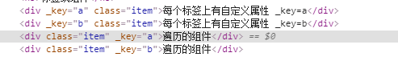
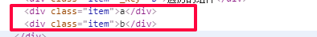

# Vue@2.6.10 step_01

## 组件：v-for
```js
// vue 1.0
v-for="(index,val) in array" track-by="id"

// vue 2.0
v-for="(val,index) in array" :key="index"
```

* 和`Array.forEach()`内部参数位置一致；


## 组件：遍历

* 遍历标签或组件：**添加自定义属性，需要前面加：**

```html
<div class="item" v-for="(val,key) in obj_1" :_key=key>
    每个标签上有自定义属性 _key={{key}}
</div>

<cpt v-for="(val,key) in obj_1" :_key=key></cpt>
```

```js
// ---------------------------------------遍历的组件
// 被遍历的组件，作为标签使用，自定义属性会加在根标签上；
var cpt = {
  template: `<div class="item">遍历的组件</div>`,
};
```

* 被添加后的效果：



* 若遍历的标签或组件，**给v-指令添加值，前面不需要加：**

```html
<div class="item" v-for="(val,key) in obj_1" v-html=key></div>
```



* 使用：**不是v-指令，就加：**
  * 如果遇见的v-指令，不需要加：
  * 如果遇见的自定义属性，需要加：

* 不加：，就是属性赋值；


## 组件：watch

```js
  // 
  watch: {
    // 指定监听
    a: function(_new, _old) {
      console.log(_new, _old);
    },
    'ajax.get': function(_new, _old) {
      console.log(_new, _old);
    },
    // 该回调会在任何被侦听的对象的 property 改变时被调用，不论其被嵌套多深
    ajax: {
      handler: function(_new, _old) {
        console.log(_new, _old);
      },
      deep: true
    },
  },
```


## 组件：生命周期

```js
// vue1.0: 
//   created               --创建实例
//   beforeCompile         --编译之前，树是空的
//   compiled              --编译之后，树是渲染上数据
//   ready                 --插入DOM树中
//   beforeDestroy         --销毁之前
//   destroyed             --销毁之后，组件完全失效


// vue2.0:
//   beforeCreate          --组件实例刚刚被创建,属性都没有
//   created               --实例已经创建完成，属性已经绑定

//   beforeMount           --模板编译之前，树是空的，没有插入DOM树
//   mounted               --模板编译之后，代替之前ready，

//   beforeUpdate          --组件更新之前 
//   updated               --组件更新完毕：组件内任何属性值发生改变都会执行该函数；
  
//   beforeDestroy         --组件销毁前
//   destroyed             --组件销毁后
```


## 注册组件

* 组件：{}
* 模板：必须有根节点；

```js
var cpt_1 = {
  template: `<div class="item">全局 自定义组件</div>`,
};

// 注册为全局组件
Vue.component('cpt_1', cpt_1);

// 局部组件
components:{ 
  'cpt_2':cpt_1
}
```


## 绑定组件

- vue1.0：

```js
var A = Vue.extend({
  template: `<span>我是Vue.extend继承的类，被实例化的组件</span>`,
});

// A：类
(new A()).$mount("#one");
```

- vue2.0：vue1.0的方法依然可以使用；

```html
<div class="box">
    <h1>component：测试使用</h1>
    <div class="item">
        Vue render：<span id="one"></span>
    </div>
</div>
```

```js
// ----------------------------------------component：测试使用
var one = {
  template: `<span id="one">自定义组件，通过render方法被绑定测试</span>`,
};
new Vue({
  el: "#one",
  render: h => h(one),
})
// 被指定的dom 完全被替换；
```

- 组员自己测试组件时，vue2.0的使用方式；

* 注意：
  * `vue1.0 (new A()).$mount("body");`可以绑定在body上进行；
  * `vue2.0 [Vue warn]: Do not mount Vue to < html > or < body > - mount to normal elements instead.`不能加body或HTML上；


## keep-alive 组件

* **场景：对某些数据不会需要和后台请求的动态组件做缓存；**
  * 某些数据需要和后台请求的组件不要缓存；
  * 组件内，用户有自己的操作，可以做缓存；
* 版本：
  * 2.1.0 新增 **include and exclude**
  * 2.5.0 新增 **max**：最多可以缓存多少组件实例。一旦这个数字达到了，在新实例被创建之前，已缓存组件中最久没有被访问的实例会被销毁掉。
* 使用：

```html
<!-- 基本 -->
<keep-alive>
  <component :is="view"></component>
</keep-alive>

<!-- 多个条件判断的子组件 -->
<keep-alive>
  <comp-a v-if="a > 1"></comp-a>
  <comp-b v-else></comp-b>
</keep-alive>
```

* **include and exclude**:属性允许组件有条件地缓存。二者都可以用逗号分隔字符串、正则表达式或一个数组来表示：
  * 匹配首先检查组件自身的 `name` 选项，
  * 如果 `name` 选项不可用，则匹配它的局部注册名称 (父组件 `components` 选项的键值)。匿名组件不能被匹配。

```html
<!-- 逗号分隔字符串 -->
<keep-alive include="a,b">
  <component :is="view"></component>
</keep-alive>

<!-- 正则表达式 (使用 `v-bind`) -->
<keep-alive :include="/a|b/">
  <component :is="view"></component>
</keep-alive>

<!-- 数组 (使用 `v-bind`) -->
<keep-alive :include="['a', 'b']">
  <component :is="view"></component>
</keep-alive>
```

* table使用：
  * tab_1组件内部的所有操作就会被缓存；
  * tab_2组件内的操作就不会被缓存；

```html
<div class="item">
    <button @click=tab(1)>tab_1</button>
    <button @click=tab(2)>tab_2</button>
</div>
<keep-alive include="tab_1">
    <component :is=tab_name></component>
</keep-alive>
```


## 组件 自定义属性、事件

### Props

* 属性名大小写：HTML 中的特性名是大小写不敏感的，所以浏览器会把所有大写字符解释为小写字符。这意味着当你使用 DOM 中的模板时，camelCase (驼峰命名法) 的 prop 名需要使用其等价的 kebab-case (短横线分隔命名) 命名；

```js
Vue.component('blog-post', {
  // 在 JavaScript 中是 camelCase 的
  props: ['postTitle'],
  template: '<h3>{{ postTitle }}</h3>'
})
```

```html
<!-- 在 HTML 中是 kebab-case 的 -->
<blog-post post-title="hello!"></blog-post>
```

* 使用

```html
<cpt_prop prop_a=10 prop_b="str_b" prop_c="str_c" prop_f="success"></cpt_prop>
```

* 设置

```js
// ----------------------------------------组件 props
var cpt_prop = {
  name: "cpt_prop",
  template: `
  <div class="item">
    <div>{{prop_a}}</div>
    <div>{{prop_b}}</div>
    <div>{{prop_c}}</div>
    <div>{{prop_e}}</div>
    <div>prop_f:{{prop_f}}</div>
  </div>`,
  props: {
    // 基础的类型检查 (`null` 和 `undefined` 会通过任何类型验证)
    prop_a: {
      type: Number,
      default: 100
    },
    // 多个可能的类型
    prop_b: [String, Number],
    // 必填的字符串
    prop_c: {
      type: String,
      required: true
    },
    // 带有默认值的对象
    prop_e: {
      type: Object,
      // 对象或数组默认值必须从一个工厂函数获取
      default: function() {
        return { message: 'hello' }
      }
    },
    // 自定义验证函数
    prop_f: {
      validator: function(value) {
        // 这个值必须匹配下列字符串中的一个 当 prop 验证失败的时候，(开发环境构建版本的) Vue 将会产生一个控制台的警告。
        return ['success', 'warning', 'danger'].indexOf(value) !== -1
      }
    }
  }
};
```

### 自定义事件

* 场景：子组件传递数据给父级组件

```js
var cpt_prop = {
  name: "cpt_prop",
  template: `
  <div class="item">
    <div>{{prop_a}}</div>
  </div>`,
  props: {
    // 基础的类型检查 (`null` 和 `undefined` 会通过任何类型验证)
    prop_a: {
      type: String,
      default: "100"
    },
    ...
  },
  mounted: function() {
    // 注册并响应
    this.$emit('cpt_ev', this.prop_a);
  }
};
```

```html
<cpt_prop prop_a="10" prop_b="str_b" prop_c="str_c" prop_f="success" @cpt_ev=_do></cpt_prop>
```

* _do：父级组件的事件；

### 场景

* 最大的使用场景还应该是就组件传递数据；
* v-指令可以直接在组件上使用的替换：
  * 以自定义属性传入；


## 通信组件

* 使用：单一事件管理的通信组件；
  * 传递 简单类型 的 值；
  * 传递 复杂类型 的 地址；

```js
// ----------------------------------新建通信组件
var ev = new Vue();


var bro_1 = {
  template: `<span>{{info}}，1s后emit给组件2</span>`,
  data: function() {
    return {
      info: "我是组件1的数据"
    }
  },
  mounted: function() {
    // 在绑定后1s 触发
    setTimeout(() => {
      // 注册事件名称，触发
      ev.$emit("ev_bro_1", this.info);
    }, 1000);
  },
};
var bro_2 = {
  template: `<span>{{info}}</span>`,
  data: function() {
    return {
      info: "我是组件2的数据"
    }
  },
  mounted: function() {
    // 响应
    ev.$on("ev_bro_1", function(data) {
      this.info = data;
    }.bind(this));
  },
};
```


## axios@0.19.0

* github:https://github.com/axios/axios

### 基本用法

```js
// ---------------------------------------------axios
// 这样的方式还是参考与vue 1.0 的方式，挂载到原型对象上，每个实例都可以使用；
Vue.prototype.$http = axios;

var methods = {
    _get: function() {
        this.$http
            .get('./test_data.js', {
                params: {
                    id: 12345
                }
            })
            // 
            .then(function(res) {
               // console.log(res.data);
               this.ajax.get = res.data;
            }.bind(this))
            .catch(function(error) {
               console.log(error, 1);
            });
    },
    _post: function() {
        this.$http
            .post('/api/js_demo/font.do', {
            firstName: 'Fred',
            lastName: 'Flintstone'
        })
            .then(function(res) {
                this.ajax.post = JSON.stringify(res.data);
            }.bind(this))
            .catch(function(error) {
            console.log(error, 1);
        });
    },
}
```

### 拦截器

* 用于请求前，loading组件显示，请求完后，loading组件隐藏
* 执行函数内部必须返回，不然就拦截了。

```js
// 拦截器
axios.interceptors.request
  .use(function(request) {
    // 发送请求时的执行函数
    console.log(request);

    // 没有返回就拦截了；
    return request;
  }, function(error) {
    return Promise.reject(error);
  });


axios.interceptors.response
  .use(function(response) {
    // 收到响应时的执行函数；
    console.log(response);

    return response;
  }, function(error) {
    return Promise.reject(error);
  });
```


## vue-router@3.0.1

### 基本使用

* 需知：
  * 和vue-router@1.x.x一样，有三种写代码的方式，可以参考demo_005
  * 我们确认选择第三种方式，配置路由：**路由数据在组件内，在组件模板内遍历；**

* 路由视图组件：路由数据异步获取，设置 名字-->link

  * `<router-link v-for="ele in nav" to=ele.path>{{ele.name}}</router-link>` to前面没有：不能绑定路由link；
  * `router-link`的修改：包裹标签，更换ac

  ```html
  <router-link v-for="ele in nav" :to=ele.path tag="li" active-class="active" >
      <a href="javascript:;">{{ele.name}}</a>
  </router-link>
  ```

```js
// --------------------路由视图组件
var router_box = {
  template: `
    <div id="router_box">
      <div class="box">
        <h1>router：路由数据在组件内，在组件模板内遍历</h1>

        <h6>&nbsp;</h6>
        <h3>路由选项</h3>

        <div class="item">
          <router-link v-for="ele in nav" :to=ele.path>{{ele.name}}</router-link>
        </div>

        <div class="item">
          <router-link v-for="ele in nav" :to=ele.path tag="li" active-class="active" >
            <a href="javascript:;">{{ele.name}}</a>
          </router-link>
        </div>

      </div>

      <div class="box">
        <h3>具体路由展示</h3>
        <div class="item">
          <router-view></router-view>
        </div>
      </div>
    </div>
  `,
  data: function() {
    return {
      nav: null
    }
  },
  mounted: function() {
    setTimeout(() => {
      // console.log(this);
      this.nav = [
        { path: '/nav_1', name: 'nav_1' },
        { path: '/nav_2', name: 'nav_2' },
        { path: '/nav_more', name: 'nav_more' },
      ];
    }, 1000);
  }
};
```

* 准备路由组件：路由组件内部参数还可以继续使用；

```js
// --------------------路由组件
var nav_1 = {
  template: `
    <div>
      <h4>nav_1的内容</h4>
      <h4>$route.params.id：{{$route.params.id}}</h4> 
      <h4>$route.path：{{$route.path}}</h4> 
      <h4>$route.query：{{$route.query.name}}</h4>
    </div>`,
};
var nav_2 = {
  template: `
    <div>
      <h4>nav_2的内容</h4>
      <h4>$route.params.id：{{$route.params.id}}</h4> 
      <h4>$route.path：{{$route.path}}</h4> 
      <h4>$route.query：{{$route.query.name}}</h4>
    </div>`,
};
var nav_more = {
  template: `
    <div>
      <h4>nav_more的内容</h4>
      <h4>$route.params.id：{{$route.params.id}}</h4> 
      <h4>$route.path：{{$route.path}}</h4> 
      <h4>$route.query：{{$route.query.name}}</h4>
    </div>`,
};
```

* 配置关联：link--->cpt及默认指向

```js
// -----------------配置：path-->组件 关联、默认指向
var routes = [
  // -----关联
  {
    path: '/nav_1',
    component: nav_1,
  },
  // 
  {
    path: '/nav_2',
    component: nav_2,
  },
  // 
  {
    path: '/nav_more/:id',
    component: nav_more,
  },
  // ------默认指向
  { path: '/', redirect: '/nav_1' },
  // 
  { path: '/nav_more', redirect: '/nav_more/1' }
];
```

* 配置路由
  * 切换路径模式：
    * 默认hash模式：使用 URL 的 hash 来模拟一个完整的 URL，于是当 URL 改变时，页面不会重新加载。变成history模式，默认是访问路径带`#`;
    * History模式：
      * 本地测试会有小问题，因为本地测试在某个目录下，浏览器地址是文件夹地址，开启历史模式，切换路由会变为根路径的形式，但没有报错；
      * **真实环境没有问题，因为真实环境是单页面，路由为根路径访问很正常；所以表现为用户可以更改浏览器地址而页面不刷新；**需要后台配置；
      * 历史模式原理：利用了HTML5 History Interface 中新增的pushState() 和replaceState() 方法。需要特定浏览器支持history模式，会出现404 的情况，需要后台配置。
  * 页面回到默认状态：滚动条滚动的行为，不加设置，默认就会记忆原来滚动条的位置；

```js
var router = new VueRouter({
  routes: routes,
  // mode: 'history',
  // scrollBehavior: () => ({ y: 0 }),
});
```


* 开启路由：

```js
// 开启路由
new Vue({
  // 绑定组件
  el: '#router_box',
  render: h => h(router_box),

  // 设置路由
  router: router,
});
```

### this.$router/this.$route

- router配置到组件后，**路由组件**内的属性；
  - `this.$route`：对象
  - `this.$router`：对象（方法）；
    - go
    - push
    - replace()

* 切换路由的使用：

```js
var nav_1 = {
  template: `
    <div>
      <h4>nav_1的内容</h4>
      <h4>$route.params.id：{{$route.params.id}}</h4> 
      <h4>$route.path：{{$route.path}}</h4> 
      <h4>$route.query：{{$route.query.name}}</h4>

      <button @click=go(1)>go(1) 下一路由</button>
      <button @click=go(-1)>go(-1) 上一路由</button>
      <button @click=push()>push 历史记录且转跳到/nav_2路由</button>
      <button @click=replace()>replace 当前历史记录且转跳到/nav_2路由</button>
    </div>`,
  methods: {
    // 参数需要number类型，-1为上一个历史记录，1为下一个历史记录（必须得有历史记录）
    go: function(num) {
      this.$router.go(num);
    },
    // 直接添加一个路由,表现切换路由，本质往历史记录里面添加一个
    push: function() {
      this.$router.push({ path: "/nav_2" });
    },
    // 替换当前的路由，不会往历史记录里面添加
    replace: function() {
      this.$router.replace({ path: "/nav_2" });
    }
  },
};
```

### 导航生命周期

* **作用：可以监听路由切换**
* 全局钩子函数：
  * 注意：`next: Function`，这是一个必须需要调用的方法，而具体的执行效果则依赖 next 方法调用的参数；不调用就会卡到这个函数不会执行，组件没有效果；

```js
// router.beforeEach(function(to, from, next) {
//   alert("路由每次变化--前")
//   next();
// });
// router.afterEach(function(to, from) {
//   alert("路由每次变化--后")
// });
```

* 配置路由时，配置钩子函数：(了解)

```js
cont router = new VueRouter({
    routes: [
        {
            path: '/file',
            component: File,
            beforeEnter: (to, from ,next) => {
                next();
            }
        }
    ]
});
```

* 路由组件内的导航钩子配置：

```js
var nav_more = {
  template: `
    <div>
      <h4>nav_more的内容</h4>
      <h4>$route.params.id：{{$route.params.id}}</h4> 
      <h4>$route.path：{{$route.path}}</h4> 
      <h4>$route.query：{{$route.query.name}}</h4>
    </div>`,
  updated: function() {
    console.log(this);
  },
  watch: {
    $route: function(_new, _old) {
      console.log(_new, _old);
    }
  },
  // beforeRouteEnter(to, from, next) {
  //   进入该路由之前
  //   console.log(to, from);
  //   next();
  // },
  //
  // beforeRouteUpdate(to, from, next) {
  //   路由更新前
  //   console.log(this, 1);
  //   next();
  // },
  // beforeRouteLeave(to, from, next) {
  //   路由离开前;
  //   console.log(to, from);
  //   next();
  // }
};
```

* 与各种监听的区别：
  - `updated`：监听只要是组件内所有的属性（包括路由参数）发生变化时，调用该函数；
  - 路由钩子函数主要用于**监听路由的切换**
  - `watch.$route`：只要是用于监听该属性值的变化；与`updated`可代替使用；切换是监听不到的；

### keep-alive

* 如果对`<router-view></router-view>`包裹`keep-alive`

```html
<keep-alive include="nav_1">
    <router-view></router-view>
</keep-alive>
```

* `include`条件选择为`tab_1`组件（需要在组件内设置name属性），那么如果`tab_1`内有异步请求，设置缓存，切换路由后，异步请求不会发出。所以`keep-alive`组件的使用看情况而定；

```js
var nav_1 = {
  name: "nav_1",
  template: `
    <div>
      <h3>nav_1的内容</h3>

      ...

      <h4>num:{{num}} 1s后异步变化</h4>
    </div>`,
  data: function() {
    return {
      num: 1
    }
  },
  mounted: function() {
    setTimeout(() => {
      this.num++;
    }, 1000);
  }
};
```


## vuex@2.0.0

* 单独的说就是有可能是多个视图依赖于同一个状态。因此，我们为什么不把组件的共享状态抽取出来，以一个全局单例模式管理呢？在这种模式下，我们的组件树构成了一个巨大的“视图”，不管在树的哪个位置，任何组件都能获取状态或者触发行为！
* 官方的说法简单的来说：数据管理中心。

### 基本使用

* 配置store.js

```js
// 数据中心
var state = {
  num: 1,
  // 
  other: "",
};

// 注册的事件名
var mutations = {
  add: function(state, other) {
    // other 是执行时传递的参数
    state.num++;

    // 
    if (other) {
      state.other = other;
    }

  },
};

var store = new Vuex.Store({
  state: state,
  mutations: mutations,
});
// store 和 组件的this.$store一样
```

* 绑定store

```js
new Vue({
  // 绑定组件
  el: '#vuex_box',
  // 
  render: h => h(vuex_box),

  store: store,
});
```

* 子组件内的使用：
  * 注意：使用数据中心内的变量必须放入`computed`属性；
  * 使用响应的方法：`this.$store.commit`

```js
var vuex_cpt_1 = {
  name: "cpt_1",
  template: `<div class="item">
    <div>cpt_1</div>
    <div>num：{{num}}</div>
    <div>other：{{other}}</div>
    <button @click=add>num++</button>
  </div>`,
    
  // 
  computed: {
    num: function() {
      return this.$store.state.num;
    },
    other: function() {
      return this.$store.state.other;
    },
  },
  methods: {
    add: function() {
      // this.$store.commit('add', 'xx');
      this.$store.commit('add', Math.random());
    },
  }
};
```

### 配合axios拦截器

```js
axios.interceptors.request.use(function (config) {  //配置发送请求的信息
    
    stores.commit('showLoading');
    
    return config;
}, function (error) {
    return Promise.reject(error);
});

axios.interceptors.response.use(function (response) { //配置请求回来的信息
    
  stores.commit('hideLoading');
    
  return response;
}, function (error) {
  return Promise.reject(error);
});
```


## 数据传递小结

* **若只是父子数据传递：props、组件的自定义事件**
* **若是兄弟组件传递数据：使用单一事件管理;**
* **若是很多组件之间的数据传递：vuex；**


## 混入 mixins

* **把公共的数据和方法混入组件内部？**
* 混入选项为数据data,发生冲突时取组件内的属性：

```js
var mixin = {
  data: function () {
    return {
      message: 'hello',
      foo: 'abc'
    }
  }
}

new Vue({
  mixins: [mixin],
  data: function () {
    return {
      message: 'goodbye',
      bar: 'def'
    }
  },
  created: function () {
    console.log(this.$data) // => { message: "goodbye", foo: "abc", bar: "def" }
  }
})
```

* 混入钩子函数，混入对象的钩子函数在组件的钩子函数之前调用：

```js
var mixin = {
    data: function () {
        return {
            message: 'hello',
            foo: 'abc'
        }
    },
    mounted: function() {
        console.log(this.foo);
    },
};

export default {
    mixins: [mixin],
    data: function() {
        return {
            msg_bak: '',
        }
        // return;
    },
    mounted: function() {
        console.log(this.$store);
    },
}
```

* 混入选项为对象时，例如 methods, components 和 directives，将被混合为同一个对象。两个对象键名冲突时，取组件对象的键值对。

```js
var mixin = {
    methods: {
        foo: function () {
            console.log('foo')
        },
        conflicting: function () {
            console.log('from mixin')
        }
    }
}

var vm = new Vue({
    mixins: [mixin],
    methods: {
        bar: function () {
            console.log('bar')
        },
        conflicting: function () {
            console.log('from self')
        }
    }
})

vm.foo() // => "foo"
vm.bar() // => "bar"
vm.conflicting() // => "from self"
```

* 全局混入：注意使用！ 一旦使用全局混入对象，将会影响到 所有 之后创建的 Vue 实例。使用恰当时，可以为自定义对象注入处理逻辑。

```js
// 为自定义的选项 'myOption' 注入一个处理器。
Vue.mixin({
    created: function () {
        var myOption = this.$options.myOption
        if (myOption) {
            console.log(myOption)
        }
    }
})

new Vue({
    myOption: 'hello!'
})

// => "hello!"
```


